# 🎓 EduMange - Modern School Management System
<div align="center">


A modern Full-Stack School Management Platform built with **React**, **Laravel REST API**, and **MySQL**, designed to simplify academic and administrative management through dedicated workspaces for administrators, teachers, and students.


</div>

---

## 📖 Overview

EduManage is a comprehensive school management platform developed to digitize and simplify educational administration.

The application centralizes daily academic operations through a secure role-based system, allowing administrators, teachers, and students to access dedicated dashboards tailored to their responsibilities.

Built using a modern **React + Laravel REST API** architecture, the project emphasizes scalability, maintainability, security, and user experience while following software engineering best practices. The authentication layer relies on Laravel Sanctum with Bearer Token authentication, and the frontend communicates with the backend through RTK Query.

---

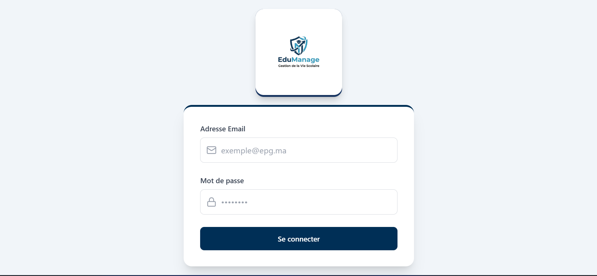

---

## 🎯 Objectives

The main objectives of EduManage are:

- Digitalize school administration.
- Simplify communication between school actors.
- Improve student academic monitoring.
- Centralize educational resources.
- Automate repetitive administrative tasks.
- Provide real-time statistics and dashboards.
- Ensure secure access through role-based authentication.

# ✨ Features

EduManage provides a complete digital ecosystem that simplifies the daily management of educational institutions by offering dedicated workspaces for each type of user.

---

# 👨‍💼 Administrator Features

The administrator has full control over the entire platform.

### Dashboard

- Global Statistics
- Total Students
- Total Teachers
- Total Classes
- Today's Schedule
- Active Classes Overview

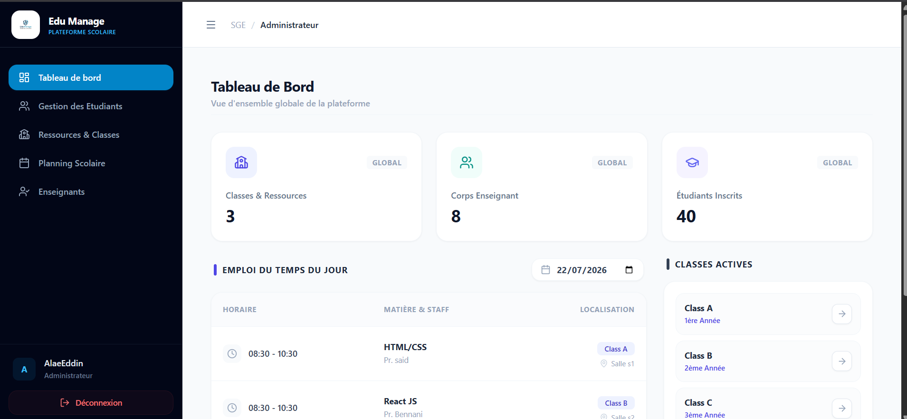

---

### Student Management

The administrator can:

- Add new students
- Update student information
- Delete student records
- Search students
- View student details
- Assign students to classes

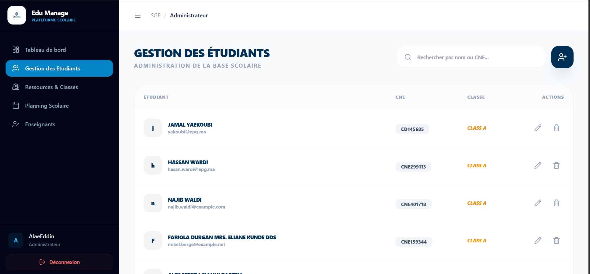

---

### Teacher Management

Features include:

- Add teachers
- Edit teacher information
- Delete teachers
- Assign teachers to classes
- Manage teaching subjects

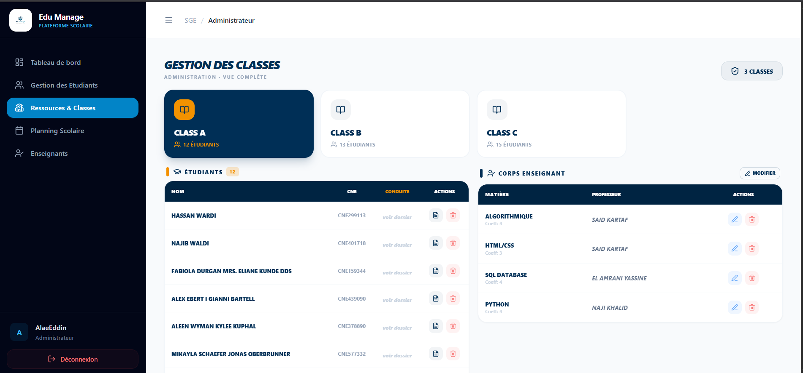

---

### Class Management

The administrator can:

- Create classes
- Update class information
- Assign students
- Assign teachers
- Manage classrooms


---

### Subject Management

- Create subjects
- Edit subjects
- Delete subjects
- Assign teachers to subjects

---

### Timetable Management

The scheduling module allows administrators to:

- Create weekly schedules
- Update schedules
- Delete sessions
- Filter schedules by date
- Organize classes efficiently

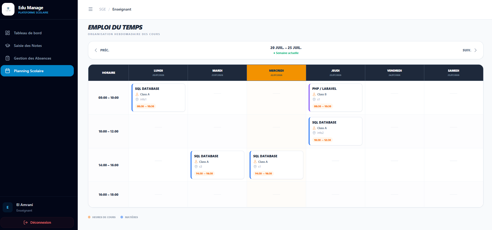

---

# 👨‍🏫 Teacher Features

Teachers have their own dedicated workspace for managing academic activities.

---

### Teacher Dashboard

The dashboard provides quick access to:

- Assigned classes
- Today's schedule
- Academic overview

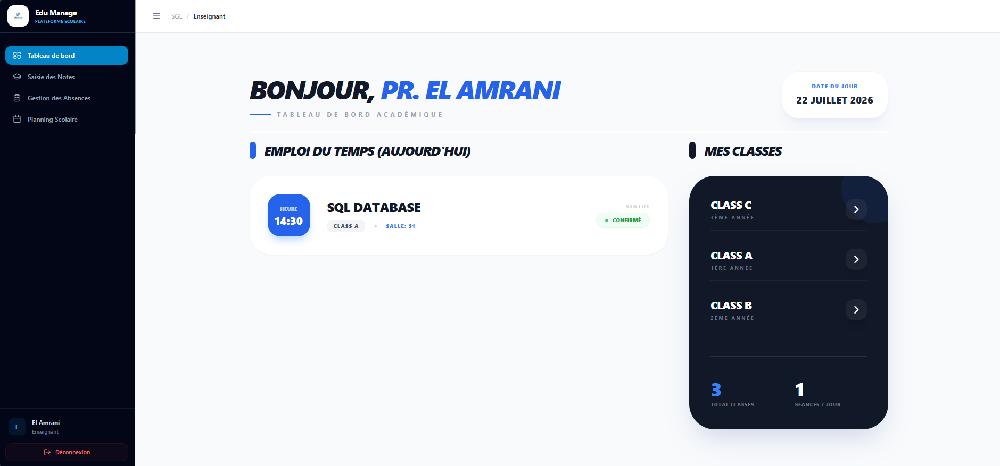

---

### Grade Management

Teachers can:

- Select a class
- Select a subject
- Enter grades
- Update grades
- Calculate averages automatically

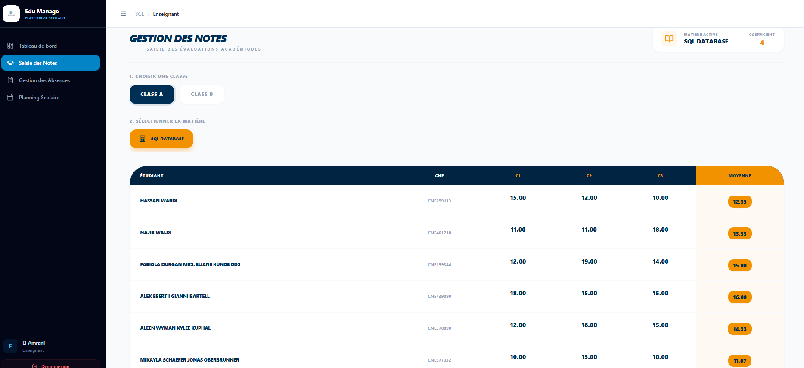

---

### Attendance Management

The attendance system allows teachers to:

- Mark students as Present
- Mark students as Absent
- Mark students as Late
- View attendance statistics instantly

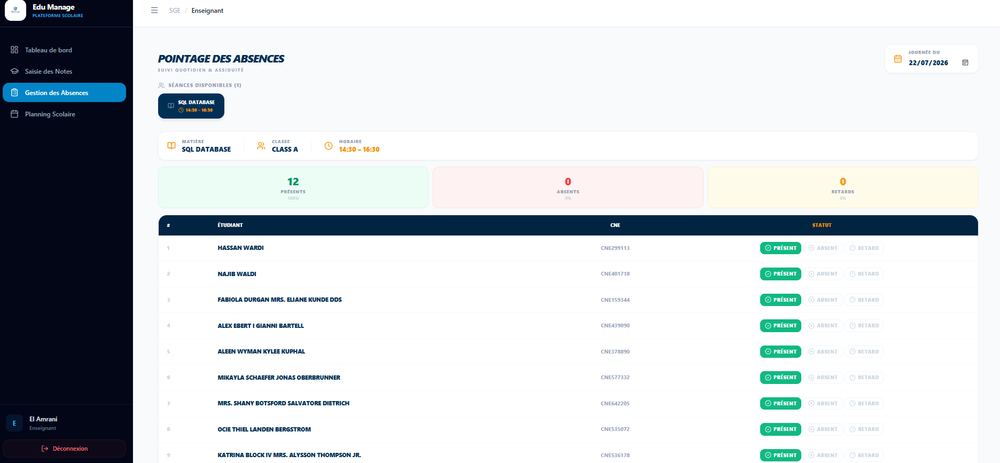

---

### Weekly Schedule

Teachers can consult their personalized weekly timetable.


---

# 👨‍🎓 Student Features

Students have read-only access to their academic information.

---

### Student Dashboard

Students can view:

- Attendance Summary
- Behavior Score
- Today's Schedule
- Academic Overview

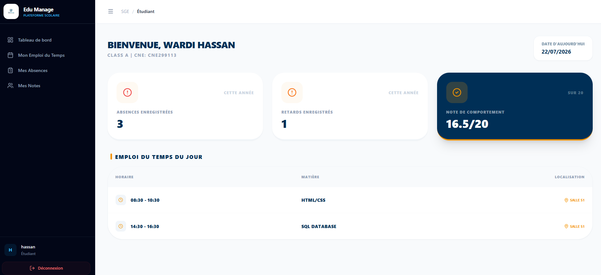

---

### Grades

Students can consult:

- Individual Subjects
- Continuous Assessments
- Average Grades
- Global Average

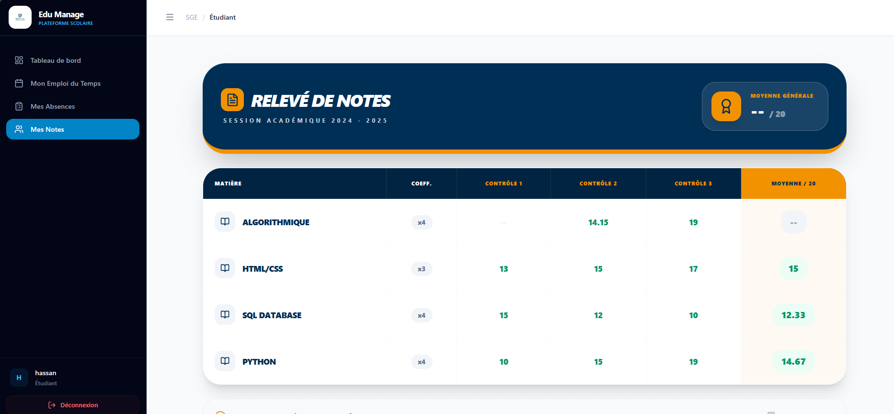

---

### Timetable

Students can access their weekly class schedule.

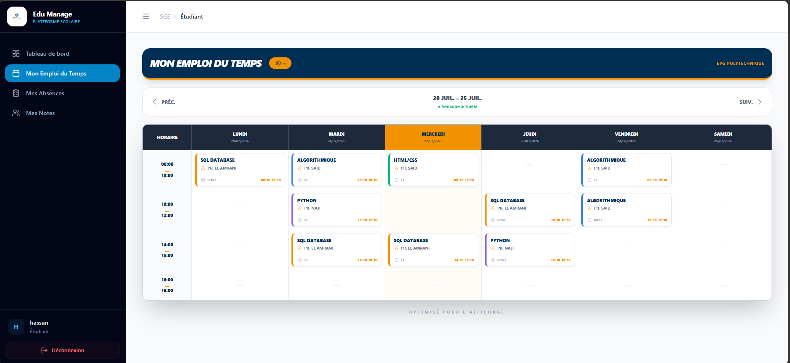

---

# 🔐 Authentication & Security

EduManage implements secure authentication using Laravel Sanctum.

Security Features:

- Role-Based Access Control (RBAC)
- Protected API Routes
- Bearer Token Authentication
- Session Management
- Secure Login
- Protected Resources
- Unauthorized Access Prevention

---

# ⚡ API Communication

The frontend communicates with the backend using RESTful APIs.

Main characteristics:

- REST Architecture
- JSON Responses
- RTK Query Integration
- Axios HTTP Client
- Secure Bearer Token Authentication
- Optimized Data Fetching
- Automatic Cache Management

# 🛠 Technology Stack

EduManage is built using modern web technologies following a scalable client-server architecture.

---

## Frontend

| Technology | Purpose |
|------------|---------|
| React.js | User Interface |
| React Router | Client-side Routing |
| Redux Toolkit | State Management |
| RTK Query | API Communication |
| Axios | HTTP Requests |
| Bootstrap | Responsive UI |
| JavaScript (ES6+) | Frontend Logic |

---

## Backend

| Technology | Purpose |
|------------|---------|
| Laravel | REST API |
| Laravel Sanctum | Authentication |
| Eloquent ORM | Database Management |
| PHP | Backend Language |

---

## Database

| Technology | Purpose |
|------------|---------|
| MySQL | Relational Database |

---

## 👥 Équipe du Projet
## Development Tools

* **Réalisé par :** Othmane EL GHAZZALI
- Visual Studio Code
- Git
- GitHub
- Postman
- Composer
- npm

---

## 🔑 Comptes de Test (Scénario de Démonstration)
# 🏗 System Architecture

Voici les identifiants de test pour découvrir les différents espaces et rôles de la plateforme (**Réalisation & Démonstration**) :
**password** :password

EduManage follows a modern **Three-Tier Architecture**.

### 👤 1. Administration
* **Rôle :** Admin
* **Email :** `admin@epg.ma`

```text
+------------------------------------------------+
|                React Frontend                  |
|  Components • Redux • RTK Query • Bootstrap    |
+------------------------------------------------+
                    │
                    │ REST API
                    ▼
+------------------------------------------------+
|               Laravel Backend                  |
| Controllers • Services • Models • Sanctum      |
+------------------------------------------------+
                    │
                    │ Eloquent ORM
                    ▼
+------------------------------------------------+
|                 MySQL Database                 |
+------------------------------------------------+
